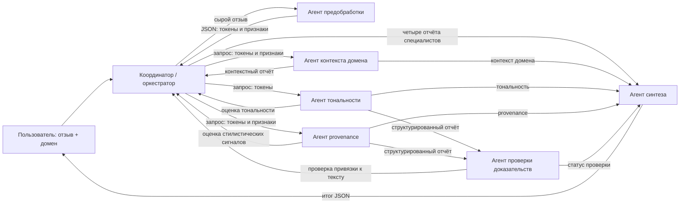

# Архитектура прототипа к 5-й неделе

## Тема и обоснование

**Разработка мультитасковой Transformer-модели и веб-системы для совместного анализа тональности и классификации происхождения отзывов с контролируемым исследованием на нескольких доменах.**

Система исследует две связанные, но различные метки: тональность отзыва и оценку вероятных стилистических признаков AI-generated текста. Общая мультитасковая Transformer-модель в дальнейшем сможет использовать общее представление текста и отдельные выходные головы для каждой задачи. Многоагентная оболочка отделяет контекст домена, две целевые задачи, проверку оснований результата и формирование ответа. Так легче локализовать ошибки, независимо оценивать задачи и безопасно добавлять модель. Это обоснование архитектуры, а не утверждение, что мультиагентный подход уже доказал преимущество над монолитной моделью; такое сравнение относится к исследованию.

Система не устанавливает личность автора. Эвристическая provenance-оценка в прототипе не определяет фактическое происхождение текста, а показывает признаки и ограничения.

## Схема взаимодействия

Это фиксированный конвейер под управлением координатора. Координатор планирует следующий шаг, передаёт контекст, считает шаги и собирает состояние; он не выполняет предметную обработку отзыва. Первым вызывается preprocessing-agent: он получает сырой отзыв, извлекает токены и признаки, а его JSON-отчёт становится входом для context-, sentiment- и provenance-agent. Специалисты обмениваются версионированными объектами `AgentMessage` (поля `run_id`, `message_id`, `sender`, `recipient`, `message_type`, `payload`, `status`, `schema_version`). Выходы sentiment и provenance реально становятся входами evidence-agent; итоговый synthesis-agent получает оба отчёта и контекст/проверку.

## Состояние, инструменты и ограничения

На запуск создаётся явный `RunState`: идентификатор запуска, текст и домен, лимит шагов, счётчик шагов, накопленные отчёты и события. Оркестратор останавливается после восьми шагов; текущий граф использует шесть вызовов специалистов. Структура сообщения проверяется перед и после вызова; предусмотрен один повтор при ошибке формата/чтения. События включают агента, статус, шаг, попытку, длительность и структурированные вход/выход. `--log-dir` сохраняет их в JSONL. В журнале есть входной текст внутри межагентных сообщений, поэтому не следует передавать чувствительные отзывы; перед исследовательским развертыванием требуется политика приватности и минимизации логов.

Два локальных ресурса прототипа: JSON-словарь доменных лексиконов (контекст и оценка тональности) и Python-инструмент извлечения токенов/простых текстовых признаков (счётчики, длина слов, пунктуация). Они не являются внешними научными наборами данных или API. Для Ассайнмента 4 следует интегрировать реальные данные/модель и соответствующие внешние источники, если они нужны проекту.

Для проверки нагрузки логируются отдельно все вызовы специалистов и инструменты: предобработка вызывает `text_features`, контекст и sentiment читают доменный словарь, provenance применяет набор сигналов, evidence проверяет привязку к исходному тексту. Synthesis не вызывает внешних инструментов. В стандартном сценарии получается шесть вызовов специалистов и пять вызовов инструментов; координатор выполняет шесть маршрутизаций. Метрика порога считает именно LLM- и tool-вызовы, а вызовы агентов отображает отдельно: в текущем сценарии у пяти специалистов по одному tool-вызову из пяти (20%), у synthesis — ноль. Максимальная доля ниже порога 40%. Распределение рассчитывается из событий конкретного прогона и сохраняется вместе с JSONL-трассой. LLM-вызовов пока нет; будущую модель нужно будет учитывать в тех же логах.

## Граница этапа

| Этап | Результат |
|---|---|
| **Неделя 5 (сейчас)** | Тема и обоснование; архитектура 6 специализированных агентов + координатор; контракты; работающий CLI-прототип с межагентным обменом; пример логов/трассы. |
| **Неделя 10** | Работа всех производственных агентов; интеграция обученной/выбранной multitask Transformer-модели и набора контролируемых данных; надёжные повторы и тайм-ауты; не менее четырёх тестовых сценариев; логи нагрузки и её проверка ≤40%; оценивание по доменам. |
| **Экзамен** | Финальная демонстрация, не менее шести сценариев (плюс базовые требования полного проекта), отчёт 5–10 страниц, презентация до 10 слайдов, результаты и ограничения исследования. |

План этапов и сценарии приведены в [сценариях](scenarios.md); контракты каждого участника — в [спецификации](agent-specification.md).
